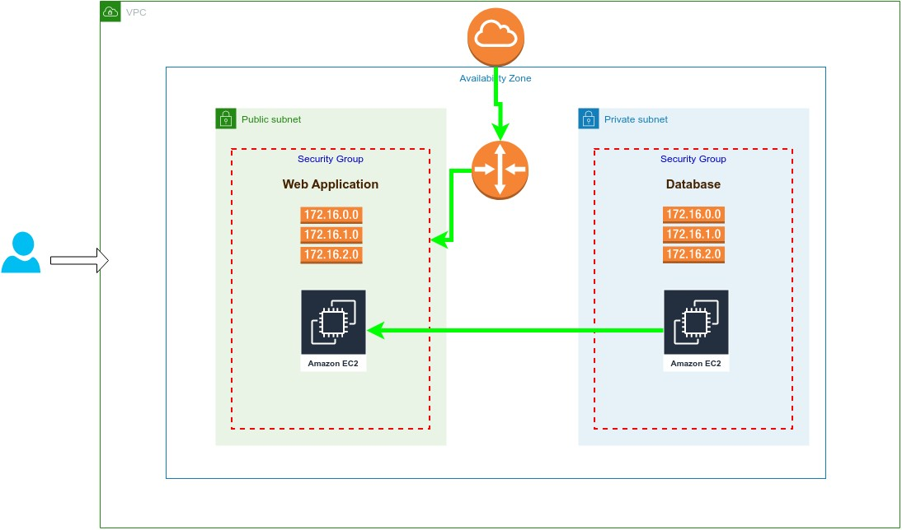

# Infrastructure Automated Using AWS And Terraform

- Create a VPC and subnets
- Create an internet gateway and route table to make the subnet public
- Create security groups
- Create an ec2 instance on a public subnet and install nginx
- Create an ec2 instance on private subnet and install database

Run Terraform
-------------

- terraform init: Setup a new terraform project for this file.
- terraform apply: Setup the infrastructure as it’s defined in the .tf file.
- terraform destroy: Tear down everything that terraform created.
- terraform state list: Show everything that was created by terraform.
- terraform state show aws_instance.web_instance: Show the details about the ec2 in-
stance that was deployed
